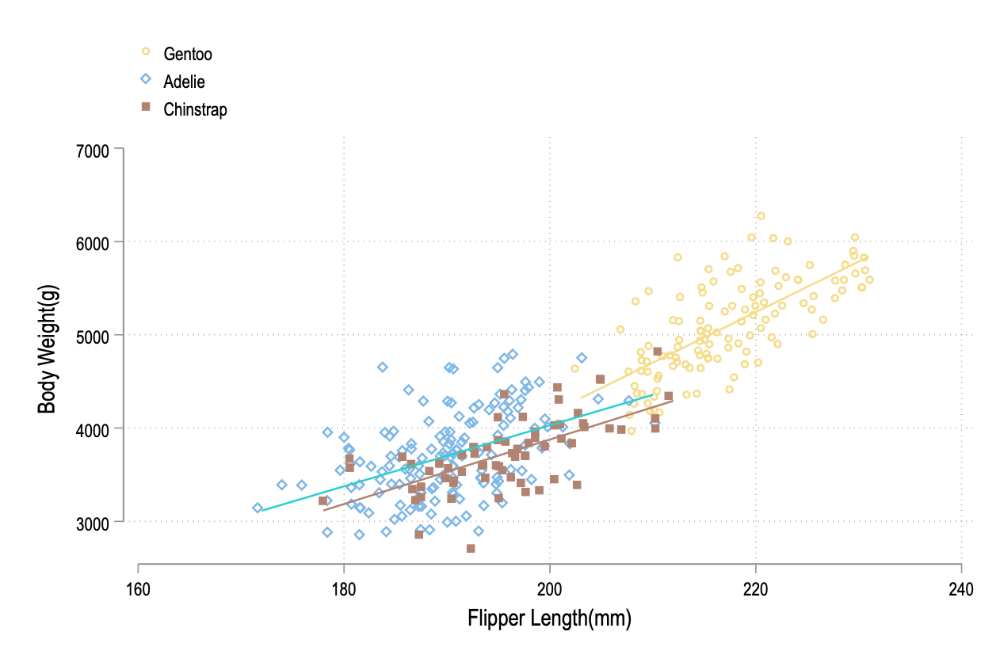

```{r, include= FALSE}
knitr::opts_chunk$set(echo = TRUE, include = TRUE, warning = FALSE,
                      message = FALSE, cache = TRUE, fig.align = "center", tidy = "styler")
```


```{r setup, echo = FALSE, include = FALSE}

pacman::p_load("tidyverse", "scales", "modelsummary", "kableExtra", "Manu", 
               "highr")
theme_allen  = function(title_pos = "center", axis_title_pos = "left", slides = FALSE, has_subtitle = FALSE, base_size = 14, ...) {
  
  # Check if fonts were loaded. If not, load them
  if( !("Roboto Condensed" %in% sysfonts::font_families()) ) {
    sysfonts::font_add_google("Roboto Condensed", "Roboto Condensed")
    sysfonts::font_add_google("IBM Plex Sans", "IBM")
    showtext::showtext_auto()
  }
  
  title_hjust <- switch(title_pos, "center" = 0.5, "left" = 0)
  axis_title_hjust_y <- switch(axis_title_pos, "center" = 0.5, "left" = 1.0)
  axis_title_hjust_x <- switch(axis_title_pos, "center" = 0.5, "left" = 0.0)
  plot_bg = dplyr::if_else(slides, "#ECECEC", "transparent")
  plot_grid = dplyr::if_else(slides, "grey85", "grey92")
  title_margin = dplyr::if_else(has_subtitle, "4", "8")
  
  # Fix problems with axis ticks getting huge with large fonts
  if(base_size >= 20) {
    check_base_size = 20
  } else {
    check_base_size = base_size
  }
  
  ggplot2::theme_bw(
    base_size = check_base_size,
    base_family = "Roboto Condensed"
  ) +
    ggplot2::theme(
      ## Title and Subtitle --------------------------------------------------
      plot.title = ggplot2::element_text(
        # Font
        family = "Roboto Condensed", face = "bold", size = 1.285 * base_size,
        colour = "#454545",
        # Center title
        hjust = title_hjust,
        # Margins
        margin = ggplot2::margin(b = title_margin, unit = "pt")
      ),
      plot.subtitle = ggplot2::element_text(
        # Font
        family = "IBM", face = "italic", size = .86 * base_size,
        colour = "#454545",
        # Center subtitle
        hjust = title_hjust,
        # Margins
        margin = ggplot2::margin(b = 16, unit = "pt")
      ),
      plot.title.position = "plot",
      
      ## Caption -------------------------------------------------------------
      plot.caption = ggplot2::element_text(
        # Font
        size = 0.72 * base_size, colour = "#454545",
        # Right-align caption
        hjust = 1,
        # Margins
        margin = ggplot2::margin(t = 10)
      ),
      plot.caption.position = "plot",
      
      ## Axis ----------------------------------------------------------------
      # Axis title
      axis.title = ggplot2::element_text(
        # Font
        size = .86 * base_size, colour = "#454545", face = "italic"
      ),
      # Axis Title x/y
      axis.title.y = ggplot2::element_text(
        # Right-align y axis title
        hjust = axis_title_hjust_y,
        # Margins
        margin = ggplot2::margin(r = 5)
      ),
      axis.title.x = ggplot2::element_text(
        # Left-align x axis title
        hjust = axis_title_hjust_x,
        # Margins
        margin = ggplot2::margin(t = 5)
      ),
      # Axis labels
      axis.text = ggplot2::element_text(
        # Font
        size = .72 * base_size, colour = "#212121"
      ),
      # Axis Lines
      axis.line = ggplot2::element_line(
        colour = "grey40"
      ),
      panel.grid = ggplot2::element_line(
        colour = plot_grid
      ),
      
      
      ## Legend -------------------------------------------------------------
      # Legend title
      legend.title = ggplot2::element_text(
        # Font
        size = .86 * base_size, colour = "#454545"
      ),
      # Legend labels
      legend.text = ggplot2::element_text(
        # Font
        size = .72 * base_size, colour = "#454545"
      ),
      legend.background = ggplot2::element_rect(
        # No Background Colour
        fill = "transparent", colour = NA
      ),
      legend.key = ggplot2::element_rect(
        # No Background Colour
        fill = "transparent", colour = NA
      ),
      
      
      ## Facet Wrap ----------------------------------------------------------
      strip.text = ggplot2::element_text(
        # Font
        size = .86 * base_size, colour = "#454545",
        # Margin
        margin = ggplot2::margin(t= 10, b= 10)
      ),
      strip.background = ggplot2::element_rect(
        # No Background Colour
        fill = "transparent", colour = NA
      ),
      
      ## Panel ---------------------------------------------------------------
      panel.background = ggplot2::element_rect(
        # No Background Colour
        fill = plot_bg, colour = NA
      ),
      panel.border = ggplot2::element_rect(
        # No Background Colour
        colour = NA
      ),
      panel.spacing = grid::unit(8, "points"),
      ## Plot ----------------------------------------------------------------
      plot.background = ggplot2::element_rect(
        # No Background Colour
        fill = plot_bg, colour = NA
      ),
      plot.margin = ggplot2::margin(16, 16, 16, 16, unit = "pt")
    ) +
    ## Additional options passed by user ---------------------------------------
  ggplot2::theme(
    ...
  )}


```


In this class we will use `R` to complete various assignments in class. Here I will outline basic stuff as a reference for you all.. This document was written in `Rmarkdown` so you will see how this file went from `R-Guide.Rmd` to `R-Guide.html` or `R-Guide.pdf`.

# Why R?


R is an open source language meaning anybody can make a package. R has tons of packages for a variety of disciplines and industries that surprise even the most veteran R user. 

While `Stata` has introduced the ability to work with multiple data frames at once it is not entirely intuitive and if you have an older `Stata` license you have to trick it in various ways. Additionally, this also means that you have to trick `Stata` into doing stuff. 

Consider this example in `Stata` where I am just making a graph with colors from the `manu` package in `R`

```
capture program drop colorpalette_manu
program colorpalette_manu
    c_local P #fae093, #d04e59, #bc8e7d
end
colorpalette manu, n(3) nograph
return list
local color1 = r(p1)
local colo2 = r(p2)
local color3 = r(p3)
tw (scatter body_mass_g flipper_length_mm if species== "Gentoo", ///
 mc("`color1'") jitter(2) jitterseed(1994)) ///
(scatter body_mass_g flipper_length_mm if species== "Adelie", ///
 msymbol(dh) mc("`color2'") jitter(2) jitterseed(1994)) ///
(scatter body_mass_g flipper_length_mm if species== "Chinstrap", ///
 msymbol(s) mc("`color3'") jitter(2) jitterseed(1994)) ///
 (lfit body_mass_g flipper_length_mm if species== "Gentoo", lc("`color1'")) /// 
 (lfit body_mass_g  flipper_length_mm if species== "Adelie", lc("`color2'")) ///
 (lfit body_mass_g flipper_length_mm if species== "Chinstrap", lc("`color3'")), ///
 legend(pos(11) order(1 "Gentoo" 2 "Adelie" 3 "Chinstrap")) ytitle("Body Weight(g)") ///
 scheme(cleanplots)
 
```

this gives us this plot

```{r stata-plot, include=TRUE, echo=FALSE}

```


Whereas in R you simply need to do this 

```{r manu-plot}

penguins = read_csv("penguins.csv")

color1 =  get_pal("Hoiho")

ggplot(data = penguins, aes(x = flipper_length_mm, y = body_mass_g , color = species,
                            shape = species)) +
  geom_point(position = position_jitter(width = 0, height = 0.25, seed = 1234)) +
  geom_smooth(method = "lm", se = FALSE) +
  labs(x = "Flipper Length(mm)", y = "Body Mass(g)", fill = "Species of Penguins") +
  theme_bw() +
  scale_color_manual(values = color1) +
  scale_x_continuous(breaks = scales::pretty_breaks(n = 10)) +
  scale_y_continuous(breaks = scales::pretty_breaks(n = 10))


```


Both have a sufficient amount of complexity, but this quickly becomes a lot more complicated as you have more and more values that you need to color in the graph. It is also hard to track because you are tricking `Stata` by defining your own program and individually coloring each line based on local macros and then you need to define each shape. Additionally, the `Stata` plot has a lot of issues with overplotting, and the hex colors don't align with the actual specified values

The free aspect makes it incredibly attractive for many people, not including the fact that in the data science world, `R` is one of the most popular languages. There are lots of debates about `R` versus `Python` versus `Julia`, but knowing any of these three will help you learn the other because they are object-oriented languages. `R` is not inherently better than `Stata`, but it is not as widely used, and the fundamentals you learn in `Stata` are not as transferable to other programming languages. 

## Getting Started 

Before we start getting into R and how to use it, we should start with workflow.
It is essential to adopt what is known as project-oriented workflow  not only
reproducibility, but to guard yourself against the possibility of arson.

```
# This is bad
rm(list=ls())
set.wd("/Users/josh/Dropbox/R-Resources")


```
There are lots of reasons that this bad the first point that I will raise is a bit more technical the second is more practical for a guide of this nature. 

The first reason that you should not do this is that your workflow is incredibly fragile and will likely have stuff in R's memory
that can cause you unknown problems. `rm(list=ls())` only removes objects from the environment window, but all your packages remain loaded which may cause you problems. Without a fresh `R` session you might run into what are known as masking issues that will cause your code to behave differently.

The more important reason is that if you have a machine at work that has different
file paths or a different operating system than a personal machine this might also
cause problems. As an example I have a laptop and desktop that I switch between fairly often here are the directories that this project lives on 

```
setwd("/Users/Josh/Dropbox/R-Guide") ## Laptop


setwd("/Volumes/6TB Raid 10/Dropbox/R-Guide") ## Desktop

```

 I cannot emphasize this enough, but `R` is flexible but it only does what it is told. For it to do something as simple as importing a dataset it needs to know where to find that dataset. Searching for files in `Finder` or `File Explorer` is effective for **you** to find files but **not** for `R`. In `Rstudio` you can find the dataset you need to import through these things but that takes time each time you need to do anything. The defaults for this approach work well enough if the data is organized well. But that isn't often the case and will require some manipulation when you just to import it into `R`.

Organizing things into files is the first part of making your life easier when working with `R` or any other software language. Here is what this guide looks like on both machines


```{r include = TRUE}

```


For this command to work `R` needs to know where to look for `this_project.png`. I know which machine I am working on but `R` does not. In `R` I cannot point and click my way to include this picture in this document. The file path to this project is hidden to us but it is in the same file `R-Guide` but in slightly different locations.


When you start a new project in `R` it is like taking off in a plane the destination is the place where that file ultimately lives. How to get to that file is the itinerary with various stops in between. In this case it would either be `Users`, `Josh`, `Dropbox`, and `R-Guide`. Or it would be `Volumes`, `6TB Raid 10`, `Dropbox`, and `R-Guide`. In each flight the destination is `this_project.png` but the route is slightly different.


For more on project oriented workflow and why I am protecting you from arson see this [post](https://www.tidyverse.org/blog/2017/12/workflow-vs-script/)


# Basics 

To start off with I think I am obligated to tell you that I am a `tidyverse` person which has some benefits and some drawbacks. I will not get into them but this is a future you problem. The `tidyverse` is shorthand for a lot of packages with a similar logic and argument structure. But not every package writer is a tidyverse person. This will be helpful as we first learn `R` because how people write functions differs in fairly significant ways.

## Loading and installing packages

When you first open `Rstudio` you have some preloaded packages. However, I will guarantee that when you start working with `R` more and you need to do more complex things you will have to use other functions. The `tidyverse` is not one of these packages that is loaded when you open `Rstudio` so if you copy and paste the code from the knitted document it will not work. That is because `R` does not have the instructions it needs to run those commands. In order for it to have those directions you need to load packages with those directions.

To do this you have to first download the package and then load the package like this 

```
install.packages("tidyverse")
library(tidyverse)
```
If you want to install and load multiple packages you have to do something like this

```
#option 1
install.packages("tidyverse")
install.packages("scales")
install.packages("Manu")

library(tidyvers)
library(scales)
library(Manu)


# option 2
install.packages(c("tidyverse","scales", "Manu"))

library(tidyvers)
library(scales)
library(Manu)


```


This is what a typical `R` script looks like if you download somebody else's code. If you want to do anything in `R` including using our friends in the `tidyverse` you have to load the packages in `R` or in your case since you are a brand new `R` user you also have to download them. For the most part in this class you will be using a lot of built in `R` functions like `t.test`, `mean`, and friends. These are loaded in automatically, but for the most part you are going to need add in some friends.

```
library(tidyverse)
library(scales)
library(modelsummary)
library(kableExtra)
library(Manu)
```


I use this general setup for loading and installing packages which will appear throughout this document. 

```

pacman::p_load("tidyverse", "scales", "modelsummary", "kableExtra", "Manu")


```
`pacman` is a fantastic package if you are moving between
machines or sharing stuff.[^1] 

I am lazy so the `library(blah)` part is a bit tedious for me, but practically if
somebody or your other machine does not have [modelsummary](https://vincentarelbundock.github.io/modelsummary/index.html) installed or any of the other packages
installed they will not have to go through the trouble of

```
install.packages(c("all", "those", "packages", dependencies = TRUE))

library(blah)
```
which is convenient but doesn't save you from some other annoying aspects of `R`.[^2]

[^1]: Under the hood what is happening is that `R` is `pacman` is running `require` but it looks similar to the above code chunks 
[^2]: In order to do `pacman::p_load` you have to install `pacman` via `install.packages("pacman")`


## Very Basics

So working with objects part has a few components to it so we will go over them 
briefly. You will work with various kinds of things in `R` so understanding what they are is the first step.

### How we work with stuff

To do stuff in `R` you work off the premise that `R` is very powerful, but with all 
that power you have to understand that `R` just follows instructions without question. Lets look at this very simple example

```{r error-example, error=TRUE}
data(mpg)

ggplot(aes(x = displ, y = cty)) + 
  geom_point()


```

If you look at the environment pain we have one object `mpg` that we are working with so `R` should know that is what we are trying to do right? No! `R` is object oriented so you have to tell `R` what thing you want to manipulate. There are ways around it, but they are ***strongly*** discouraged. So to get a basic scatterplot this is what we would do.

```{r error-fix-example}

ggplot(data = mpg, aes(x = displ, y = cty)) + 
  geom_point()

```

I will add a little more on this latter but for now lets just use this as a toy example.

### Assignment operators

There are three basic assignment operators `<-` is leftward assignment and is `<` followed by `-`, `->`  is rightward assignment which is `-` followed by `>`, and `=` is argument assignment and leftward assignment. Most often when you look at other people's code you will see people use `<-`. This is by in large a convention in `R` that has been carried over from when keyboards had `<-` on them from the mainframe computer days. If we look at the code chunk below than you will see that all three operators behave pretty similarly for this simple task.


```{r assignment-example}

a = c(1, 3, 5, 6, 8)

print(a)

b = c(1, 3, 5, 6, 8)

print(b)

c(1, 3, 5, 6, 8) -> d

print(d)


```


I am what most would call lazy so I prefer `=` over `<-` for convenience sake. However, there are valid reasons to prefer one over the other. There are various arguments for or against both. The difference real comes down to preference. [^3]

[^3]: [this is a good top level summary](https://github.com/Robinlovelace/geocompr/issues/319#issuecomment-427376764) and 
[this which is a more in depth coverage](https://www.separatinghyperplanes.com/2018/02/why-you-should-use-and-never.html)


### Types of Stuff

We have a few basic kinds of classes in `R`

- character: ("a", "swc")
- numeric(real or decimal): (2, 15.5)
- integer: 2, -2, 7
- logical: `TRUE`, `FALSE`
- date: 11-24-2021

Different arguments take different classes of variables. Sometimes you need to coerce variables to be of a kind of class, but these are what you are going to work with most of the time.

### Vectors


The first thing we work with are vectors which are the most basic that can  *be*  various `classes`. 


```{r vector-example}
x = c(1, 3, 5, 6, 8)

x

class(x)


z = c("a", "b", "c", "d", "e")

z

class(z)

```

So to break down what happened here we made a vector `x` by doing `x = c(1, 3, 5, 6, 8)` where `c` means concatenate which basically just means this stuff goes together. `class` returns what type of vector it is which is really useful when you are trying to figure out what is going on with your code. 
For the most part a vector is going to be a column in your dataset. This is an indpendent variable, a dependent variable, or a confounding variable that we can easily manipulate. 

Consider the example below where we just multiply `x` by 2. If we just want to multiply it by two that is fine. But if we want to work with `x*2` we have to assign it to a **new** object. 


```{r}
x*2 


x2 = x*2

x2


```

We can get basic descriptive statistics of both vectors by doing 

```{r}
summary(x)
```


### Lists

a `list` is something we will work with a lot that can *contain* various classes 

```{r list-example}

list1 = list(1,2,3)

list2 = list("Sun","Mon","Tue")

list3 = c(list1,list2)

print(list3)


```

## Matrices 

You can think of matrices as a dataset so our `mpg` dataset is a matrix. If we do this


```{r matrix}
y = cbind(a,z)

y
```

now we have a matrix of our vectors that we made earlier. A matrix is just two or more vectors combined together. This should be intuitive if you have ever run into matrix algebra. 


# Manipulating data

To add a huge caveat. If you are moving over from Excel or Stata you have the option of manipulating data through a drop down or just recoding the variable  either through `edit` in Stata or just changing the number in the cell. 

However whenever possible you want to do this through code. It is transparent and reproducible which lets other people learn and you have it forever. Practically it is also quicker in many cases becasue the computer can do it quicker and more accurately if it is given the right instructions. There are a bunch of ways to do it so we will separate it into a few ways.

## `dplyr`


`dplyr` is a great package that I use all the time to clean data. But you need to get the basic functions right. Cleaning data is what you will spend the most time on. 


### Boolean Operators


So before we start working with our friends `select`, `filter`, `mutate`, and `summarize` we should start with what Boolean operators are because they are how we get what we want in working with `dplyr`. So lets start by working with the the `starwars` dataset. 


```{r load-starwars, error=TRUE}

data("starwars")
head(starwars)
```


So we have our data in now lets try manipulate the data where we only care about droids. So lets do that through our friend `filter`


```{r droids-error, error=TRUE}


filter(starwars, species = "Droid")

```

As you can see `filter` throws an error because we aren't using our Boolean operators. These are your boolean operators

- `==` is equal to 
- `!` is equivalent to not
- `|` is equivalent to or
- `>` is greater than
- `<` is less than
- `!=` is not equal to
- `>=` is greater than or equal to 
- `<=` is less than or equal to
- `&` is and 


### `filter`

Lets combine what we just learned

```{r basic-filter}


filter(mpg, manufacturer == "audi")


filter(starwars, homeworld == "Naboo")


filter(starwars, homeworld != "Naboo")


```


What we are doing here is just creating a dataset with just stuff made by audi, just things from Naboo, and where everything is not from Naboo. But, this isn't actually going to do anything yet. If you want this to become a real dataset you need to create a new object. So lets just take the starwars data and create a naboo object. 


```{r star-wars-example-filter}


naboo = filter(starwars, homeworld == "Naboo")


```


You can also make an object combining boolean operators like this 

```{r}
naboo2 = filter(starwars, homeworld == "Naboo" & species == "Human")
```

Now we have all the characters that are from Naboo and are human!


When working with things in `R` stray commas and spelling will lead to head aches. here is an example that would not throw an error but will create a dataframe with zero observations. Naboo exists as a value of homeworld but naboo does not.  

```{r dplyr-error, error= TRUE}

 
 naboo = filter(starwars, homeworld == "naboo")

naboo = filter(starwars, homeworld == "Naboo",)
```


### `mutate`

`mutate` is how we create new columns in our dataset. So lets take our starwars dataset and create a new column which is an indicator variable for whether or not a character is a human or not 


```{r mutate-example}
starwars_human = starwars %>% 
  mutate(human = ifelse(species == "Human", TRUE, FALSE)) %>% 
  select(human, name)

head(starwars_human)


```

Here we are doing a little bit more stuff than we have covered. So lets walk through it. We made a new variable called `human` if `species` takes the value of human. `R` recognizes `TRUE` and `FALSE` but you can also sub in `1` and `0` and `R` will treat them virtually the same. We also introduced your best friend `%>%` which is technically called a pipe. However, you should read it as **and then**. The easiest way to think of the pipe when working through stuff is this way from [Andrew Heiss](https://twitter.com/andrewheiss/status/1359583543509348356?lang=en) using your morning routine.


```
me %>% 
wake_up(time = "8.00am") %>% 
get_out_of_bed(side = "correct") %>% 
get_dressed(pants = "TRUE", shirt = "TRUE") %>% 
leave_house(car = TRUE, bike = FALSE, MARTA = FALSE) %>% 
am_late(traffic = TRUE)

```

Our friend mutate can do a lot. So lets make a column in our dataset where we see how old a character is in dog years with a description so other people know what is going on! 


```{r}
starwars %>% 
  filter(!is.na(birth_year)) %>% 
  select(name, birth_year) %>%
  mutate(dog_years = birth_year * 7) %>%
  mutate(comment = paste0(name, " is ", dog_years, " in dog years."))
```

You can make this code more concise because `mutate` is order aware this will do the exact same thing. 

```{r}
starwars %>% 
  filter(!is.na(birth_year)) %>% 
  select(name, birth_year) %>%
  mutate(dog_years = birth_year * 7,
         comment = paste0(name, " is ", dog_years, " in dog years."))
```

Data cleaning is the vast majority of what you will be doing if you open up a dataset. You will spend a lot of mental energy on learning how the stats behind what happens when you estimate models. However, whether you run something as simple as 

```
lm(y ~ x1 + x2 + x3, data = blah)

```

or are making graphs. Data cleaning is a skill that you have to practice in order to make any claims about your data. 
### `select`


Now lets move on to our  friend `select`. `Select` will literally just select columns from your object that you specify. So lets take our object `starwars_humnan` and then go really extreme and just take the `human` column and our name column.


```{r select-example}

extreme = starwars_human %>% 
  select(human, name)

head(extreme)


```


### `group_by` and `summarize`

I tend to use these two commands together because they are pretty well matched. `group_by` collapses data to single row by a column or columns in our dataset. Think of this as collapsing our data to your unit of analysis. Like country or if you have panel data where we observing multiple countries over multiple years we can use `group_by` to look at `country and year`.  To see a simple example lets load in data that tracks flights  out of New York City.


```{r}

pacman::p_load("nycflights13")

data(flights)
```
Imagine that we want to explore the relationship between the distance and average delay for each location. Using what you know about dplyr, you might write code like this with pipes. We should also remove missing values with `na.rm = TRUE`.


```{r flights}
delays = flights %>% 
  group_by(dest) %>% 
  summarise(
    count = n(),
    dist = mean(distance, na.rm = TRUE),
    delay = mean(arr_delay, na.rm = TRUE)
  ) %>% 
  filter(count > 20, dest != "HNL")
```


Then lets plot the data the data for fun!

```{r}

ggplot(data = delays, mapping = aes(x = dist, y = delay)) +
  geom_point(aes(size = count), alpha = 1/3) +
  geom_smooth(se = FALSE)


```

What if we forgot our friend `group_by`? Well unfortunately `filter` does not work in this case so we had to delete that. Now what happened is we are getting a single value for each of the variables we initially wanted, but it is not entirely helpful.


```{r}
delay = flights %>% 
  summarise(
    count = n(),
    dist = mean(distance, na.rm = TRUE),
    delay = mean(arr_delay, na.rm = TRUE)
  ) 
```


Then lets plot the data! 


```{r}
ggplot(data = delay, mapping = aes(x = dist, y = delay)) +
  geom_point(aes(size = count), alpha = 1/3) +
  geom_smooth(se = FALSE)
```


# Data Vizsualization 


We will cover this more in depth but the skill that will carry help you stand out or help you understand what is going on is being able to present your findings and data graphically. People are good at seeing patterns in stuff so it will be helpful to get a basic grasp of the most popular `tidyverse` friend `ggplot`. Lets some toy data about penguins to go through this example and load in a package named `patchwork` and `ggthemes`. 


```{r load-data-penguin-data, message=FALSE, warning=FALSE}
pacman::p_load("patchwork", "ggthemes")


penguins = read_csv("penguins.csv")

```


The function we are going to be working with is `ggplot` there are a lot of components to it and it is a little
overwhelming at first. But this is the basic logic of `ggplot`

- `data` tells `R` what data we are using for this plot. 
- `aes` tells `R` what columns in the dataset we want graphed
- `geom_blah` tells `R` what kind of plot we want. 

As an example in `Stata` it is `tw scatter varlist, options` to create a scatter plot.
We will see how that differs.

Here is a basic scatter plot in `ggplot`
```{r scatter-basic}

ggplot(data = penguins) +
  geom_point(aes(x = flipper_length_mm, y = body_mass_g))


```


Notice that in `aes` we told `R` what columns to use for our `x` and `y` axis.
Unlike `Stata` or `SAS` we have to tell  `R` what object to use. Whereas in Stata you would do this 

```

tw scatter body_mass_g flipper_length_mm

```

`R` has a lot of solutions to the same problem
This is usually how I graph stuff. 
[`R` for Datascience](https://r4ds.had.co.nz/index.html) covers this better than I could.
Since this is an intro we will side step style guides and just work with what I do.

```{r scatter-basic-global}
ggplot(penguins, aes(x = flipper_length_mm, y = body_mass_g)) +
  geom_point()
```

Like `Stata` you need to add stuff to customize plot when you add stuff instead
of `,options` you use `+` and then add stuff. Here is an example of things you can add, but
this is only the tip of the iceberg.

```{r scatter-plot-labs}

ggplot(penguins, aes(x = flipper_length_mm, y = body_mass_g)) +
  geom_point() +
  labs(x = "Flipper Length(mm)", y = "Body Mass(g)")


```

So far we have only done stuff working within `aes`. Here is one of the most common mistakes 
when working in `ggplot`, I still do this!


```{r mistake-easy}


ggplot(penguins, aes(x = flipper_length_mm, y = body_mass_g,
                            color = "blue")) +
  geom_point() +
  labs(x = "Flipper Length(mm)", y = "Body Mass(g)")

```

I wanted to change  the color of the dots. However I did this
in the `aes()`. If you look back then, you will remember that  `aes` will look to put stuff in your 
plots based on **columns** in your dataset. So to change the look of your plot, you need to do it
**outside** of `aes()`. So let’s correct that and then change the shape of the points.

```{r real-changes}
ggplot(penguins, aes(x = flipper_length_mm, y = body_mass_g)) +
  geom_point(color = "blue", shape = 2) +
  labs(x = "Flipper Length(mm)", y = "Body Mass(g)")
```


## Subsetting data in ggplot

Let’s say you want to look at a subset of the data. That is easy because you can add in your friend `filter`.


```{r female-plot}


ggplot(penguins, aes(x = flipper_length_mm, y = body_mass_g)) +
  geom_point(data = filter(penguins, sex == "female")) +
  labs(x = "Flipper Length(mm)", y = "Body Mass(g)")


```

This also works.


```{r female-plot-pipes}

penguins %>% 
  filter(sex == "female") %>% 
  ggplot(aes (x = flipper_length_mm, y = body_mass_g)) +
  geom_point() +
  labs(x = "Flipper Length(mm)", y = "Body Mass(g)")


```


The difference is a matter of taste if we are being honest. I learned it the first way, so I tend to do it that way. In the below plots let’s change the scale of the X and Y axis and then combine the two plots using `patchwork`.

```{r female-plot-for-combo, message=FALSE, warning=FALSE}
library(scales)
fem_plot =  penguins %>% 
  filter(sex == "female") %>% 
  ggplot(aes (x = flipper_length_mm, y = body_mass_g)) +
  geom_point() +
  labs(x = "Flipper Length(mm)", y = "Body Mass(g)", title = "Female") +
  scale_x_continuous(breaks = scales::pretty_breaks(n = 10)) 


fem_plot

male_plot =  penguins %>% 
  filter(sex == "male") %>% 
  ggplot(aes (x = flipper_length_mm, y = body_mass_g)) +
  geom_point() +
  labs(x = "Flipper Length(mm)", y = "Body Mass(g)", title = "Male") +
    scale_x_continuous(breaks = scales::pretty_breaks(n = 10)) 


fem_plot/male_plot


```


# Themes in ggplot

Themes are just ways to customize all the stuff that isn't data in your plot. Themes make your graphs better looking and can make them stand out.

The themes in `ggplot` get pretty intense very quickly. Lots of people write their own themes, but this gets
scary when you are first learning ggplot, we will use `ggthemes` first, but as an example, we will look at one I wrote for 
a class assignment that I use a lot. 

```
theme_allen  = function(title_pos = "center", axis_title_pos = "left", slides = FALSE, has_subtitle = FALSE, base_size = 14, ...) {
  
  # Check if fonts were loaded. If not, load them
  if( !("Roboto Condensed" %in% sysfonts::font_families()) ) {
    sysfonts::font_add_google("Roboto Condensed", "Roboto Condensed")
    sysfonts::font_add_google("IBM Plex Sans", "IBM")
    showtext::showtext_auto()
  }
  
  title_hjust <- switch(title_pos, "center" = 0.5, "left" = 0)
  axis_title_hjust_y <- switch(axis_title_pos, "center" = 0.5, "left" = 1.0)
  axis_title_hjust_x <- switch(axis_title_pos, "center" = 0.5, "left" = 0.0)
  plot_bg = dplyr::if_else(slides, "#ECECEC", "transparent")
  plot_grid = dplyr::if_else(slides, "grey85", "grey92")
  title_margin = dplyr::if_else(has_subtitle, "4", "8")
  
  # Fix problems with axis ticks getting huge with large fonts
  if(base_size >= 20) {
    check_base_size = 20
  } else {
    check_base_size = base_size
  }
  
  ggplot2::theme_bw(
    base_size = check_base_size,
    base_family = "Roboto Condensed"
  ) +
    ggplot2::theme(
      ## Title and Subtitle --------------------------------------------------
      plot.title = ggplot2::element_text(
        # Font
        family = "Roboto Condensed", face = "bold", size = 1.285 * base_size,
        colour = "#454545",
        # Center title
        hjust = title_hjust,
        # Margins
        margin = ggplot2::margin(b = title_margin, unit = "pt")
      ),
      plot.subtitle = ggplot2::element_text(
        # Font
        family = "IBM", face = "italic", size = .86 * base_size,
        colour = "#454545",
        # Center subtitle
        hjust = title_hjust,
        # Margins
        margin = ggplot2::margin(b = 16, unit = "pt")
      ),
      plot.title.position = "plot",
      
      ## Caption -------------------------------------------------------------
      plot.caption = ggplot2::element_text(
        # Font
        size = 0.72 * base_size, colour = "#454545",
        # Right-align caption
        hjust = 1,
        # Margins
        margin = ggplot2::margin(t = 10)
      ),
      plot.caption.position = "plot",
      
      ## Axis ----------------------------------------------------------------
      # Axis title
      axis.title = ggplot2::element_text(
        # Font
        size = .86 * base_size, colour = "#454545", face = "italic"
      ),
      # Axis Title x/y
      axis.title.y = ggplot2::element_text(
        # Right-align y axis title
        hjust = axis_title_hjust_y,
        # Margins
        margin = ggplot2::margin(r = 5)
      ),
      axis.title.x = ggplot2::element_text(
        # Left-align x axis title
        hjust = axis_title_hjust_x,
        # Margins
        margin = ggplot2::margin(t = 5)
      ),
      # Axis labels
      axis.text = ggplot2::element_text(
        # Font
        size = .72 * base_size, colour = "#212121"
      ),
      # Axis Lines
      axis.line = ggplot2::element_line(
        colour = "grey40"
      ),
      panel.grid = ggplot2::element_line(
        colour = plot_grid
      ),
      
      
      ## Legend -------------------------------------------------------------
      # Legend title
      legend.title = ggplot2::element_text(
        # Font
        size = .86 * base_size, colour = "#454545"
      ),
      # Legend labels
      legend.text = ggplot2::element_text(
        # Font
        size = .72 * base_size, colour = "#454545"
      ),
      legend.background = ggplot2::element_rect(
        # No Background Colour
        fill = "transparent", colour = NA
      ),
      legend.key = ggplot2::element_rect(
        # No Background Colour
        fill = "transparent", colour = NA
      ),
      
      
      ## Facet Wrap ----------------------------------------------------------
      strip.text = ggplot2::element_text(
        # Font
        size = .86 * base_size, colour = "#454545",
        # Margin
        margin = ggplot2::margin(t= 10, b= 10)
      ),
      strip.background = ggplot2::element_rect(
        # No Background Colour
        fill = "transparent", colour = NA
      ),
      
      ## Panel ---------------------------------------------------------------
      panel.background = ggplot2::element_rect(
        # No Background Colour
        fill = plot_bg, colour = NA
      ),
      panel.border = ggplot2::element_rect(
        # No Background Colour
        colour = NA
      ),
      panel.spacing = grid::unit(8, "points"),
      ## Plot ----------------------------------------------------------------
      plot.background = ggplot2::element_rect(
        # No Background Colour
        fill = plot_bg, colour = NA
      ),
      plot.margin = ggplot2::margin(16, 16, 16, 16, unit = "pt")
    ) +
    ## Additional options passed by user ---------------------------------------
  ggplot2::theme(
    ...
  )}


```

This is what this looks like in action.

```{r multiplot}


color1 = get_pal("Kaka")

ggplot(data = penguins, aes(x = flipper_length_mm, y = body_mass_g , color = species,
                            shape = species)) +
  geom_point(position = position_jitter(width = 0, height = 0.25, seed = 1234)) +
  geom_smooth(method = "lm", se = FALSE) +
  labs(x = "Flipper Length(mm)", y = "Body Mass(g)", fill = "Species of Penguins") +
  scale_color_manual(values = color1) +
  scale_x_continuous(breaks = scales::pretty_breaks(n = 10)) +
  scale_y_continuous(breaks = scales::pretty_breaks(n = 10)) +
  theme_allen()

```


## What else can I do in `ggplot`?


`ggplot` has a ton of flexibility that you can take courses on, so I will provide some examples of graphics I have made in `ggplot`. 


```{r penguins-example-with-fonts}


theme_set(
 theme_allen()
)


 ggplot(penguins, aes(x = flipper_length_mm, y = body_mass_g)) +
  geom_point(data = filter(penguins, sex == "female")) +
  labs(x = "Flipper Length(mm)", y = "Body Mass(g)")


```

You can make maps in  `ggplot`.


```{r map, cache = TRUE, echo=FALSE}

pacman::p_load("osmdata", "ggmap", "tidygeocoder", "sf")

big_streets = getbb("Atlanta United States") %>% 
  opq() %>% 
  add_osm_feature(key = "highway", 
                  value = c("motorway", "primary", "motorway_link", "primary_link")) %>%
  osmdata_sf()

med_streets = getbb("Atlanta United States")%>%
  opq()%>%
  add_osm_feature(key = "highway", 
                  value = c("secondary", "tertiary", "secondary_link", "tertiary_link")) %>%
  osmdata_sf()


small_streets = getbb("Atlanta United States")%>%
  opq()%>%
  add_osm_feature(key = "highway", 
                  value = c("residential", "living_street",
                            "unclassified",
                            "service", "footway"
                  )) %>%
  osmdata_sf()

railway = getbb("Atlanta United States")%>%
  opq()%>%
  add_osm_feature(key = "railway", value= "rail") %>%
  osmdata_sf()


bars = tribble(
  ~name, ~address,
  "Hattie B's", "299 Moreland Ave NE, Atlanta, GA 30307",
  "Side Bar", "79 Poplar St NW, Atlanta, GA 30303",
  "Manny's", "602 North Highland Avenue Northeast, Atlanta, GA 30307",
  "The Porter", "1156 Euclid Ave NE, Atlanta, GA 30307",
  "Anatolia's", "Peachtree St, Atlanta, GA 30303",
  "Agave", "242 Boulevard SE, Atlanta, GA 30312",
  "Fetch", "520 Daniel St SE, Atlanta, GA 30312",
  "Recess", "99-V, Krog St NE, Atlanta, GA 30307",
  "Der Biergarten", "300 Marietta St NW, Atlanta, GA 30313"
)


bars_geocode = bars %>% 
  geocode(address, method = "osm")


add_geom = bars_geocode %>% 
  st_as_sf(coords = c("long", "lat"), crs = st_crs("EPSG:4326"))

 ggplot() +
  geom_sf(data = railway$osm_lines,
          inherit.aes = FALSE,
          color = "black",
          size = .2,
          linetype="dotdash",
          alpha = .5) +
  geom_sf(data = med_streets$osm_lines,
          inherit.aes = FALSE,
          color = "black",
          size = .3,
          alpha = .5) +
  geom_sf(data = small_streets$osm_lines,
          inherit.aes = FALSE,
          color = "#666666",
          size = .2,
          alpha = .3) +
  geom_sf(data = big_streets$osm_lines,
          inherit.aes = FALSE,
          color = "black",
          size = .5,
          alpha = .6) +
  geom_sf(data = add_geom, aes(color = name),
          color = "#0039A6") +
  coord_sf(ylim = c(33.64, 33.89), 
           xlim = c (-84.56, -84.30), expand = FALSE) +
   labs(title = "Atlanta", subtitle = "Restaurants and Bars Pols Students \n have had gone to for events", caption = "Dots are in GSU Blue") +
  theme_void(base_family = "Roboto Condensed", base_size = 20) +
  theme(plot.subtitle = element_text(size = 10, hjust = 0.5, 
                                     margin = margin(2, 0, 5, 0)),
        plot.title = element_text(face="bold", hjust=.5),
        plot.caption = element_text(size = 8))  
 


```


# Other Useful Stuff

So for this class, you will have to make some tables, and there are a lot of mistakes you can make when you are trying to format tables manually. But, just as important, it is tedious and annoying, so why would you waste time doing that if there is an automated way to do that? We have already loaded in our friend `modelsummary`, and since this is a `Rmarkdown` document, our friend `kable` is also loaded. So let’s see some examples of how to do this. Let’s create a fake dataset about the effect of going to math camp on GRE scores.


```{r create-data, message=FALSE, cache=TRUE, warning=FALSE}

pacman::p_load("kableExtra", "truncnorm", "broom")

n_people = 2500

grade_data = tibble(id = 1:n_people,
                    gpa =  rtruncnorm(n_people, mean = 3.5, sd = 1.0,
                                      a = 1.5, b = 4.0)) %>% 
  mutate( gpa = round(gpa,2), 
          gre_base = rbeta(n_people, shape1 = 3, shape2 = 16), 
          gre_effect = 10.1*gpa ,
          gre = gre_base + gre_effect + rnorm(n_people, mean = 150, sd = 3.5 
          ),  
          gre =  round(gre,0),
          math_score = (gre*-10.0) + (gpa*-2.0) + rnorm(n_people, mean = 0,
                                                        sd = 3),
          math_probability = rescale(math_score, to = c(0.05,0.95)),
          math_camp_num = rbinom(n_people, 1, math_probability),
          math_camp = ifelse(math_camp_num == 1,TRUE,FALSE)) %>% 
  mutate(grade_base = rbeta(n_people, shape1 = 4, shape2 = 5 ) *100,
         grade_effect = (15*gpa) + (2 * gre) + (10 * math_camp),
         final_grade = grade_base + grade_effect + rnorm(n_people, 0, sd = 2),
         final_grade = rescale(final_grade, to = c(0,100)),
         final_grade = round(final_grade,1))


```

So here are a bunch of models that you should not worry about. We use a mixture of base `R` functions and `tidyverse` friends.


```{r models, results='hide'}

# For lm we need to feed it the data argument
naive_model = lm(final_grade ~ math_camp, data = grade_data) 
tidy(naive_model)


adjusted_mod = lm(final_grade ~ math_camp + gre + gpa, data = grade_data) 
tidy(adjusted_mod)


prop_model = glm(math_camp ~ gre + gpa, family = binomial(link = "logit"),
                  data = grade_data)

camp_probabilities = augment_columns(prop_model,
                                     grade_data,
                                     type.predict = "response") %>% 
  rename(propensity = .fitted)


camp_weights = camp_probabilities %>% 
  ### To ensure that R doesn't do something weird with precedence lets wrap that
  ### in parenthesis
  mutate(ipw = (math_camp/propensity) + (1 - math_camp)/(1-propensity))

ipw_model = lm(final_grade ~ math_camp, weights = ipw, data = camp_weights)  
  tidy(ipw_model)
```

So we have a bunch of statsy stuff we want to put in a table so let’s do that!


```{r table-making}

modelsummary(list("Naive" = naive_model, "Confounders" = adjusted_mod, 
                  "IPW" = ipw_model),
             stars = TRUE ,
             output = "kableExtra",
             gof_omit = "IC|Log|F|Adj",
             coef_map = c("math_campTRUE" = "Math Camp", "gre" = "GRE",
                          "gpa" = "GPA", "(Intercept)" = "Constant"),
             title = "Effect of Math Camp on Final Grade \\label{tab:table1}") %>% 
  kable_styling(latex_options = "HOLD_position")

```

Now we have a pretty table of stats results. Don’t worry too much about the statsy stuff that we did in this case because that is a whole course that somebody far more qualified than I should be teaching you. 


```{r basic-summar}
datasummary(gpa ~ Mean, data = grade_data)
```

Doing individual tables for each variable will be annoying for you and the reader, so what if we wanted to add more variables and more stats? You can slowly build this up, but looking at the help documentation will be your best bet! 


```{r summary-sd}
datasummary(gpa + gre ~ Mean + SD,
            data = grade_data)
```

# Resources 

## Getting Started

- [R4Ds](https://r4ds.had.co.nz/index.html) is perhaps the ultimate starter book for the `tidyverse` written by the authors of the `tidyverse` and should be your first stop.

- [Hands on Programing](https://rstudio-education.github.io/hopr/)

- [R Core Manual](https://cran.r-project.org/doc/manuals/R-intro.pdf)
- [Advanced Stuff](http://adv-r.had.co.nz/)

## Rmarkdown 
[It really is definitive](https://bookdown.org/yihui/rmarkdown/)

## ggplot
Perhaps `R's` most beloved and used package in the `tidyverse`. I will say that I never really read anything on `ggplot` and tend to go full steam ahead into doing stuff. But these are the resources I use most often. 

- [Cookbook](https://r-graphics.org/)
- [All about ggplot](https://ggplot2-book.org/index.html)
- [Free class](https://datavizs21.classes.andrewheiss.com/)
- [V influential book in the social sciences](https://socviz.co/)

## misc
Working with text data has a lot of idiosyncrasies and takes a lot of wrangling.
I switched from Word to LaTeX a few years ago but never liked beamer presentations. 
So I use `xaringan` to create all my slides. 

- [tidytext](https://www.tidytextmining.com/index.html)
- [xaringan primer](https://apreshill.github.io/data-vis-labs-2018/slides.html)


